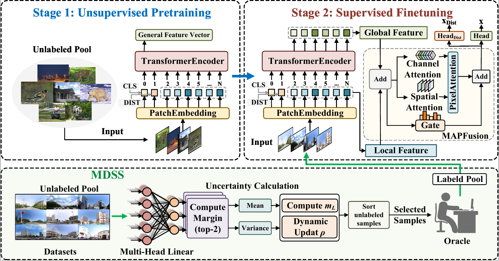

# UP-AF 项目说明

本项目实现了一个完整的主动学习流程，包含数据选择与基于 Vision Transformer 的分类模型训练，并引入 MAPFusion 模块进行特征融合。



项目主要包括：

- 数据选择(data_selection)（Core / Boundary / Margin）
- datasets 数据集
- Vision Transformer分类模型（DeiT_MAPFusion）
- results 结果保存

整体流程如下：
→ 用预训练 ViT 提取所有图像的深度特征。
→ 通过 Core Selection 选出代表性样本（核心集）。
→ 通过 Boundary Selection 选出位于类别边界的样本。
→ 通过 Margin Selection 选出当前模型最不确定的样本。
→ 合并这三个子集构成训练集。
→ 用改进的 DeiT 模型（含 MAPFusion）训练分类器。
→ 在测试集上评估并输出结果。

---

# 一、环境安装

本项目建议使用 **Anaconda / Miniconda** 创建独立环境。  
当前项目推荐环境如下：

- Python 3.7
- CUDA 12.4
- PyTorch 2.6.0
- torchvision 0.21.0
- torchaudio 2.6.0

## 1. 安装其他依赖
```
pip install -r requirements.txt
```

# 二、数据准备

本项目使用自定义数据集（Ucity 和 MIT_Place_Pulse），数据需按照如下结构组织：

```
datasets/
├── Ucity/                          # 数据集名称
│   ├── images/                     # 图像数据目录
│   │   ├── train/                  # 训练集
│   │   │   ├── 0/                  # 类别0
│   │   │   ├── 1/                  # 类别1
│   │   │   ├── 2/                  # 类别2
│   │   │   ├── 3/                  # 类别3
│   │   │   ├── 4/                  # 类别4
│   │   │   └── 5/                  # 类别5
│   │   ├── val/                    # 验证集
│   │   └── test/                   # 测试集
│   │
│   ├── categories.json             # 类别映射（类别ID → 类别名称）
│   ├── train2025.json              # 训练集标注（图像路径 + 标签）
│   ├── val2025.json                # 验证集标注
│   └── test2025.json               # 测试集标注
│
├── MIT_Place_Pulse/                # 另一数据集（结构同上）
│   ├── images/
│   │   ├── train/
│   │   │   ├── 0/                  # 共6个类别（0–5）
│   │   │   ├── 1/
│   │   │   ├── 2/
│   │   │   ├── 3/
│   │   │   ├── 4/
│   │   │   └── 5/
│   │   ├── val/
│   │   └── test/
│   │
│   ├── categories.json
│   ├── train2025.json
│   ├── val2025.json
│   └── test2025.json
│
└── deit_small_distilled_patch16_224-649709d9.pth   # DeiT 蒸馏模型权重（预训练-微调用）
```

# 三、项目目录结构

项目整体结构如下（包含各文件说明）：

```
program/
├── data_selection/                  # 数据选择模块（用于筛选训练子集）
│   ├── Boundary_Selection/          # 边界样本选择方法
│   ├── Core_Selection/              # 核心样本选择方法
│   ├── Margin/                      # margin策略选择困难样本
│   ├── subsets/                     # 保存筛选出的子集（JSON索引）
│   ├── extract_feature.py           # 提取图像特征（生成 .npy 特征文件）
│   ├── utils.py                     # 数据选择相关工具函数
│   └── vision_transformer.py        # 用于特征提取的ViT模型
│
├── datasets/                        # 数据集目录（存放Ucity/MIT_Place_Pulse等）
│
├── deit_MAPFusion/                  # 模型训练模块（基于DeiT + MAPFusion）
│   ├── datasets.py                  # 构建Dataset与数据增强
│   ├── engine.py                    # 训练与验证流程（train/eval）
│   ├── losses.py                    # 蒸馏损失函数（DistillationLoss）
│   ├── main.py                      # 主入口（训练 / 测试 / 验证）
│   ├── MAPFusion.py                 # MAPFusion特征融合模块
│   ├── models.py                    # 模型定义（DeiT / ViT / 蒸馏模型）
│   ├── predict.py                   # 批量预测脚本（输出JSON/结果）
│   ├── util.py                      # 通用工具函数（调度器/增强/优化等）
│   ├── utils.py                     # 日志记录与分布式训练工具
│   └── vision_transformer.py        # Vision Transformer主体实现
│
├── results/                         # 结果输出目录（checkpoint/曲线/预测结果）
├── requirements.txt                 # 安装依赖文件
└── README.md                        # 项目说明文件
```

# 四、运行流程
## 1. 特征提取
```
cd data_selection/

python extract_feature.py \
--dataset Ucity \
--pretrained_weights ../deit/deit_small_distilled_patch16_224-649709d9.pth
```
## 2. 数据选择
### core
```
python Core_Selection/ActiveFT_CIFAR.py --feature_path ${PATH to the extracted feature} --percent ${sampling percentage}
python Core_Selection/ActiveFT_CIFAR.py --feature_path features/Ucity_train.npy --percent 0.5
```
### boundary
```
python Boundary_Selection/density_cluster.py \
--dataset Ucity \
--indices_file_name ../subsets/Ucity/Ucity_train_ActiveFT_euclidean_temp_0.07_lr_0.001000_scheduler_none_iter_300_sampleNum_36.json \
--cur_number 36 \
--budget {budget}
```
### margin
```
cd margin/
python margin.py --features_inputs {第一部输出的特正文件:数据集名称_train.npy} --stage1_indices {subsets/core_baselines/json文件} --stage2_indices {subsets/Density_Cluster/json文件} --output_dir {输出文件夹路径} --rho {控制选样数量的参数} --auto_tau --tau_percentile {获得余量前百分比直接设置为：3} --percentiles {打印计算余量前百分之几的数值：3 5 10} --method {直接选择：ensemble}

python Margin/margin.py \
--features_inputs ../subsets/Ucity/Ucity_train.npy \
--stage1_indices ../subsets/Ucity/Ucity_train_ActiveFT_*.json \
--stage2_indices ../subsets/Ucity/Density_*.json \
--output_dir ../subsets/Ucity/Margin \
--rho 0.003 \
--auto_tau \
--tau_percentile 3 \
--percentiles 3 5 10 \
--method ensemble
```
## 3. 模型训练
```
cd deit_MAPFusion/

python main.py \
--clip-grad 2.0 \
--eval_interval 50 \
--data-set IMNETSUBSET \
--subset_ids ../data_selection/subsets/Ucity/Margin/xxx.json \
--resume ../datasets/deit_small_distilled_patch16_224-649709d9.pth \
--output_dir ../results/exp1/ \
--mixup 0.8
```
## 4. 测试
```
python main.py \
--test \
--best_ckpt ../results/exp1/best_checkpoint.pth \
--data-path dataset/images/ \
--data-set IMNET \
--result_dir ../results/exp1
```
## 5. 预测
```
python predict.py \
--data-path ../datasets/dataset_b1/images/ \
--data-set IMNET \
--ckpt ../results/exp1/best_checkpoint.pth \
--out ../results/predictions.jsonl \
--save-prob
```

